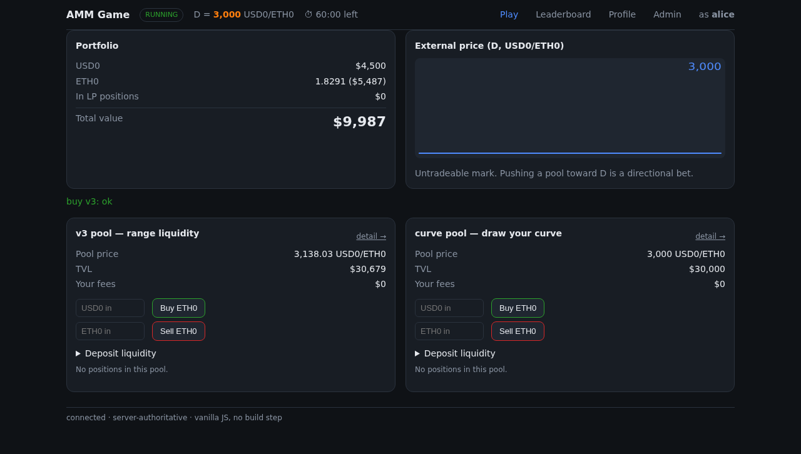
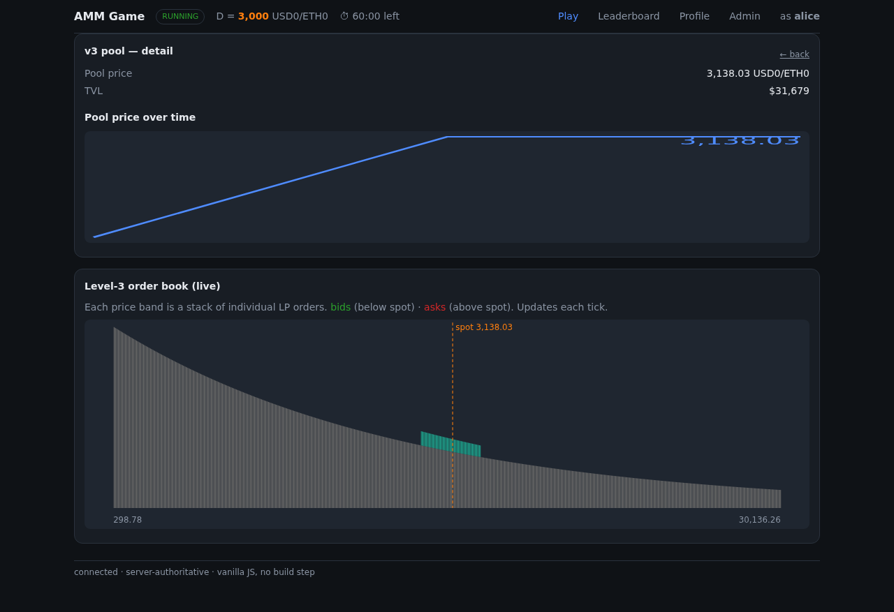
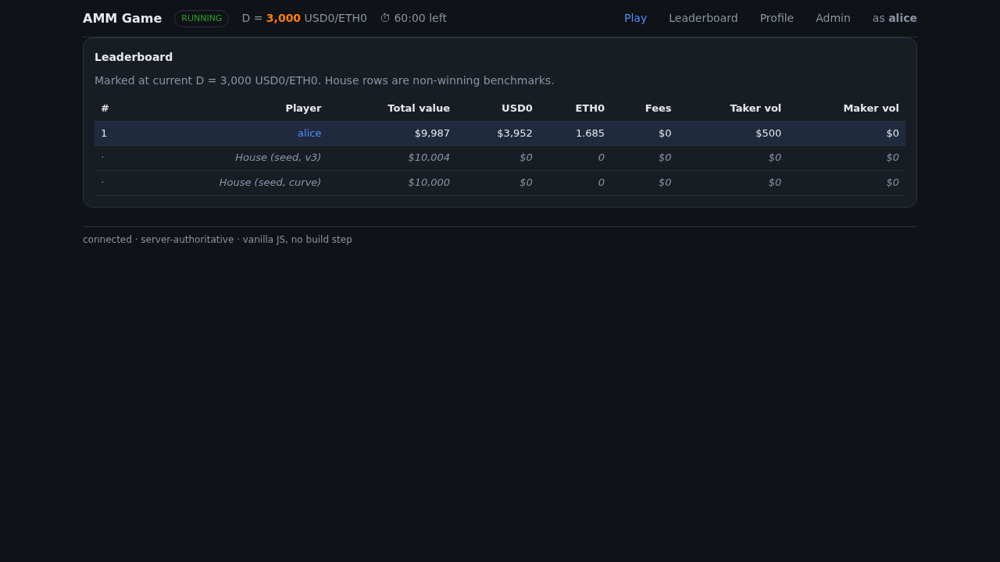

# A Better Automated Market Maker

**Reducing the inefficiencies of DeFi market makers by improving AMM formulas — higher returns for
liquidity providers, competitive prices for end users.**

Automated Market Makers (AMMs) are the engine of decentralized exchanges, but today's formulas leave
value on the table — liquidity sits where it isn't used, LPs earn less than the risk they take, and
traders pay more than they should. This project closes that gap in three connected steps:

> **Measure** how real AMMs behave → **Model** an AMM as a live order book → **Prove** it in an
> interactive product where people market-make against each other.

Each step is built, tested, and runnable. Run instructions for everything are in
**[DEPLOY.md](DEPLOY.md)**.

---

## 1. Measure — reconstruct a real Uniswap v3 pool from on-chain data

To improve on existing AMMs we first reconstruct exactly how today's concentrated-liquidity pools
behave — using **only a keyless public RPC** (no accounts, no API keys, no third-party indexer).

For the ETH/USDC 0.30% pool we download every swap / mint / burn / collect, then derive and visualize:

- **TVL over time**, **trade flow** (buys vs sells with price), and **liquidity-vs-price** depth.
- A **true level-3 order book** — individual LP positions recovered by linking each Uniswap NFT
  `tokenId`'s adds and removes across transactions.
- **Daily volume, fees, and APR**, computed from first principles. The engine's **APR ≈ 14.5%**
  lands squarely on Uniswap's published figure for the pool — an external cross-check that the math
  is right.

The pipeline (`run_all.py`) produces **8 interactive HTML figures** (a time slider over the
order book, with/without the pre-existing baseline) plus PNG charts, served locally or shared with
one command (`serve.py --tunnel`). Defaults to the **past 5 days**.

→ Technical overview: **[DETAILS.md](DETAILS.md)** · full plan & status: **[PLAN.md](PLAN.md)**

## 2. Model — an AMM *is* a virtual limit-order book

The conceptual core (**[ORDERS.md](ORDERS.md)**, with a standalone interactive `ORDERS.html`): a
concentrated-liquidity position is mathematically equivalent to a **regenerative grid of paired
limit orders**. Spot price is a pointer into a static book; a swap slides the pointer and each
crossed level flips bid↔ask, funded by the taker's own input; the fee is skimmed to the side, never
reinvested, so order sizes stay constant as price moves.

This reframing — verified numerically against the real pool above — is what makes a "draw your own
liquidity curve" AMM tractable, and it is the engine both the analysis and the game share.

## 3. Prove — a live multiplayer market-making game

A closed-economy, multiplayer game (**[`app/`](app/)**, spec **[APP_PLAN.md](APP_PLAN.md)**, build
log **[APP_WORK.md](APP_WORK.md)**) that puts the model in people's hands for a ~1-hour event.
Players get a balanced bag of two tokens and compete for the highest portfolio value, marked at a
visible-but-untradeable external price `D`, acting only through **two pools built on the same
engine**:

- a **Uniswap-v3-style range pool**, and
- a **"draw-your-curve" pool** — deposit an arbitrary non-negative liquidity profile.

Because `D` is untradeable, pushing a pool toward it is a *directional bet*, not free arbitrage — so
the game rewards genuine market-making and price views, not button-mashing.

|  Live play | Level-3 virtual book | Leaderboard |
|---|---|---|
|  |  |  |

What it demonstrates, end to end:

- **The order-book model running live** — the level-3 view shows the house seed's smooth
  `q ∝ 1/(√Pₐ·√P_b)` density and each player's drawn position, bids/asks splitting around spot.
- **An exact ledger** — the conservation invariant holds to float-epsilon (≈1e-15) through every
  trade, deposit, and fee accrual.
- **Crash-safety** — the SQLite action log is the source of truth, so a `kill -9` mid-game recovers
  to a byte-identical state (verified: zero data loss), and a forced invariant breach raises an
  alert but never halts the event.
- **Real-time** — a seeded price oracle, WebSocket push, live leaderboard, and an admin console with
  a live conservation monitor.

Stack: Python · FastAPI · SQLite (WAL) · a dependency-free vanilla-JS frontend (no build step, runs
offline). Share a populated game over a public URL with one command:
`python app/app_serve.py --tunnel --seed`.

---

## How it all connects

The **measurement** validated the **model** (APR and book shape match the real pool); the **model**
powers both the analysis engine and the **game**; the **game** is where a better curve can be tried,
scored against a passive-LP benchmark, and felt by real participants. Same engine, three lenses.

## Run it

All run instructions — the analysis pipeline, the figures, the game, public sharing, and pointing
**amm.finance** at the instance — are in **[DEPLOY.md](DEPLOY.md)**. Quick taste:

```bash
# the research figures (downloads the past 5 days, builds 8 interactive HTML, serves them)
pip install -r requirements.txt && python run_all.py && python serve.py

# the game (seeded, live, shareable)
pip install -r app/requirements.txt && bash app/run_demo.sh
```

## Tests

```bash
python tests.py          # 134 — analysis pipeline (engine invariants, replay, figures)
python app/tests.py      # 60  — game (engine, persistence, game core, API, durability)
```
